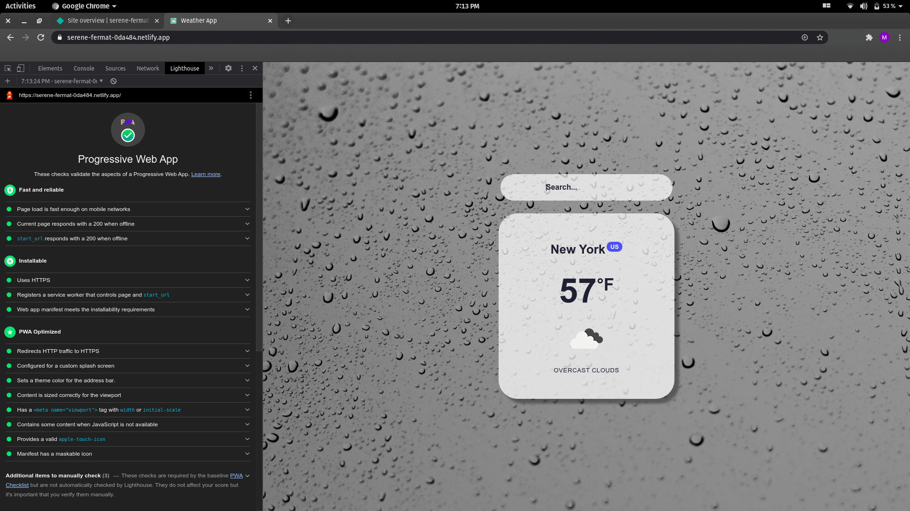

# weather_pwa

Hosted: https://weather-forecast-pwa-react.netlify.app/

A simple React Weather App with focus on the Progressive Web App aspects. It uses the OpenWeather API to fetch the City, Country, Temperature and Conditions. This is an installable app built from the web technologies but with a feel and functionality that rivals an actual native app. It runs in the browser and — once saved to the home screen — functions like a native app. 

PWAs can be built rather quickly, in regards to a native app that’s pretty difficult to develop and is built in a programming language specific to the platform.  Plus, it offers all the features of native apps, like push notifications, offline support, and much more. Many sites found online are actually a Progressive Web App, such as Twitter, Starbucks, Pinterest and Uber.

-PWAs can be built with common web technologies

-They are often cheaper to build

-Turning the site into an app results in fewer code-bases to maintain

-PWAs are responsive and work with many different screen sizes

-PWAs are smooth, fast and lightweight

-They can work offline, unlike regular sites

-The process to get into different app stores can be avoided

-PWAs are discoverable via search engines (which have a lot larger audience than app stores. Plus, PWAs can still be distributed via app stores)

-PWAs can use push notifications to re-engage users
